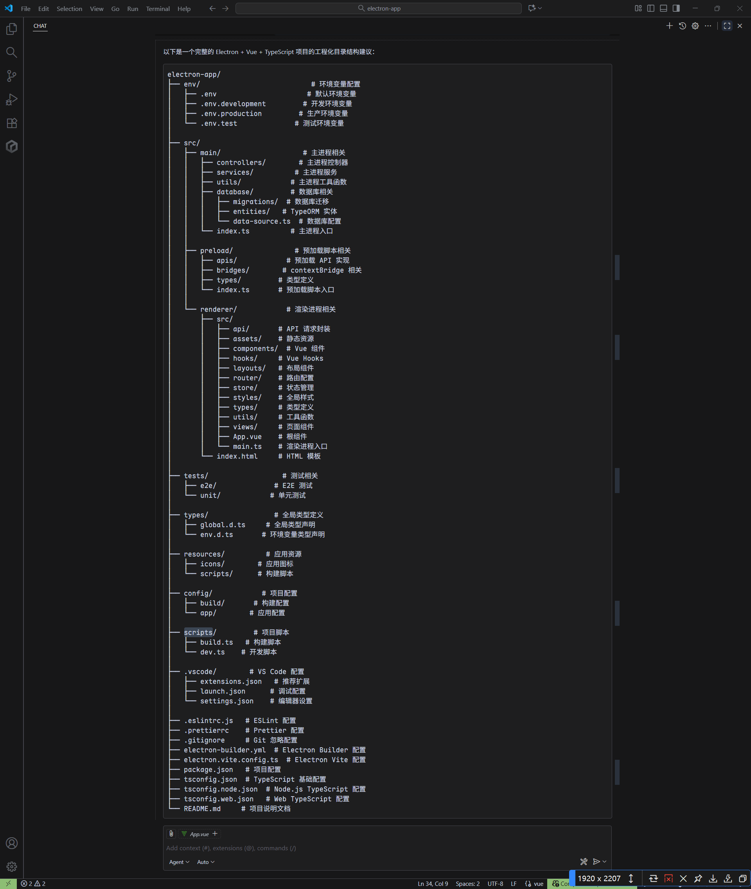
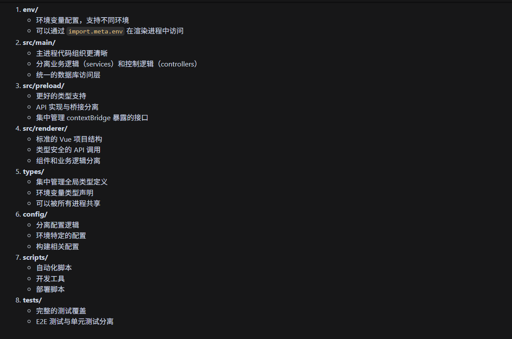

# electron-app

An Electron application with Vue and TypeScript

## Recommended IDE Setup

- [VSCode](https://code.visualstudio.com/) + [ESLint](https://marketplace.visualstudio.com/items?itemName=dbaeumer.vscode-eslint) + [Prettier](https://marketplace.visualstudio.com/items?itemName=esbenp.prettier-vscode) + [Volar](https://marketplace.visualstudio.com/items?itemName=Vue.volar)

## Project Setup

### Install

```bash
$ npm install
```

### Development

```bash
$ npm run dev
```

### Build

```bash
# For windows
$ npm run build:win

# For macOS
$ npm run build:mac

# For Linux
$ npm run build:linux
```

### Create a new project
```bash
$ npm create @quick-start/electron
```
### 目录结构


### 目录说明


### electron-vite
- [electron-vite](https://github.com/alex8088/electron-vite)
- [中文文档](https://cn.electron-vite.org/guide/)

举个生活中的例子去理解nextTick：
就像**"等菜炒完再尝味道"**：

你加了盐（修改数据），不能立刻尝（此时菜还没拌匀），得等锅铲翻炒完（DOM更新完成），再尝才知道最终味道（最新DOM状态）。

nextTick就是那个"等翻炒完"的动作。

问题: 用户首次登录时会如果用户名或密码错误会触发刷新token接口]

TODO: 封装请求按钮【vue中如何优雅的处理按钮loading】 https://www.bilibili.com/video/BV1QtxQzLEu3/?share_source=copy_web&vd_source=2d98141f0558fb205fffc50e07a5eab1

 * route.matched 匹配链条
 * 当访问一个嵌套路由时，这个链条会从根路由开始，一直延伸到你当前所在的最内层路由。
 * 例如访问 /settings/session 时, 它就会返回由根路径开始匹配的所有路由节点(包括当前节点)
 * route.matched -> [{path: '/',...}, {path: '/settings',...}, {path: '/settings/session',...} ]
 * 总结：route.matched 数组记录了你从顶层路由一路 “钻” 到当前页面所经过的所有路由节点。
 * 如上访问/settings/session时, route.matched.length 是 3。
 * route.matched[route.matched.length - 1] 就是 route.matched[2]。
 * route.matched[2] 对应的就是 { path: 'session', name: 'session', meta: { title: '活动会话' }, ... } 这个对象。
 * 所以 currentRouteTitle.value 的结果就是 '活动会话'。即当前路由就是匹配链条的最后一环。


确保动态生成的元素也能正确设置为不可拖拽：动态生成元素时主动添加 no-drag 类
